# Blueprints REST API: Implementación con Spring Boot

## Integrantes
- Laura Natalia Perilla Quintero - [Lanapequin](https://github.com/Lanapequin)
- Santiago Botero Garcia - [LePeanutButter](https://github.com/LePeanutButter)

## Parte I. Configuración Inicial y Endpoints Básicos (GET)

Se desarrolló Blueprints REST API, una API REST para gestionar planos arquitectónicos de una empresa de diseño. La solución busca ser centralizada, multiplataforma y de bajo acoplamiento entre controlador, servicios y persistencia.

La implementación se realizó con Spring Boot, usando inyección de dependencias y SpringMVC para exponer los servicios REST.

Este componente ya había sido implementado en el laboratorio anterior, pero no contaba con todos los controladores necesarios. Por ello, se modificó el bean de persistencia `InMemoryBlueprintPersistence` para que inicialice tres planos adicionales, además del que ya se encontraba preconfigurado.

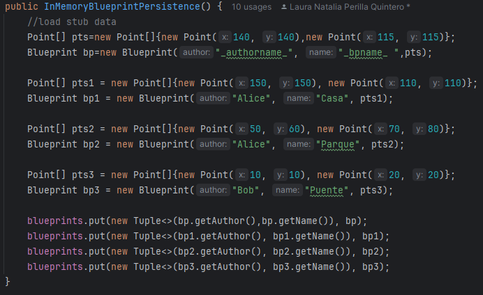

Se implementó la clase `BlueprintsController` con el objetivo de exponer varios métodos HTTP. El primero en ser desarrollado fue el método `GET`, encargado de retornar, en formato `JSON`, el conjunto completo de planos disponibles en el sistema. Además, en esta clase se inyectó el bean de tipo `BlueprintServices`, permitiendo así el acceso a la lógica de negocio y a la capa de persistencia.

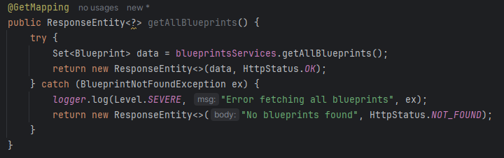

La aplicación fue ejecutada desde el entorno de desarrollo `IntelliJ IDEA`, lo que permitió iniciar el proyecto directamente con soporte de `Spring Boot`. Para probar el funcionamiento del método `GET` del recurso `/blueprints`, se utilizó `Postman` como herramienta cliente. A través de esta, se envió una petición GET a http://localhost:8080/blueprints, obteniendo como respuesta un objeto JSON con los planos precargados y con el filtrado de puntos aplicado correctamente.

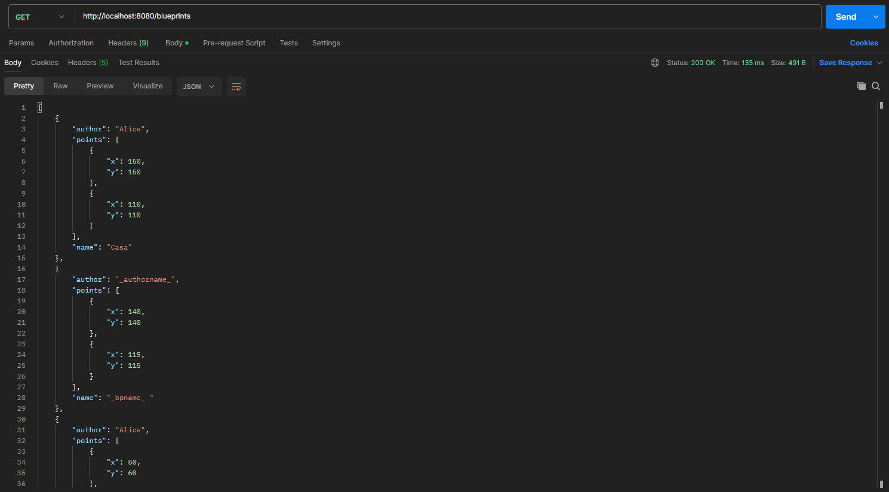

Se amplió el controlador para incluir un nuevo método GET que permite filtrar los planos según el nombre del autor, recibido como variable en la URL mediante la anotación `@PathVariable`. Este método devuelve una representación JSON con todos los planos correspondientes al autor especificado. En caso de que no exista ningún plano asociado a dicho autor, el controlador responde con un código de estado HTTP 404, indicando que el recurso solicitado no fue encontrado. Esta implementación garantiza un manejo robusto de las solicitudes y una adecuada respuesta ante casos de datos inexistentes.

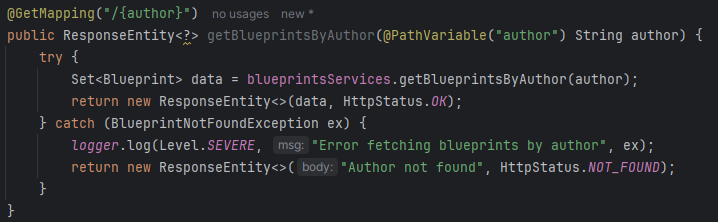

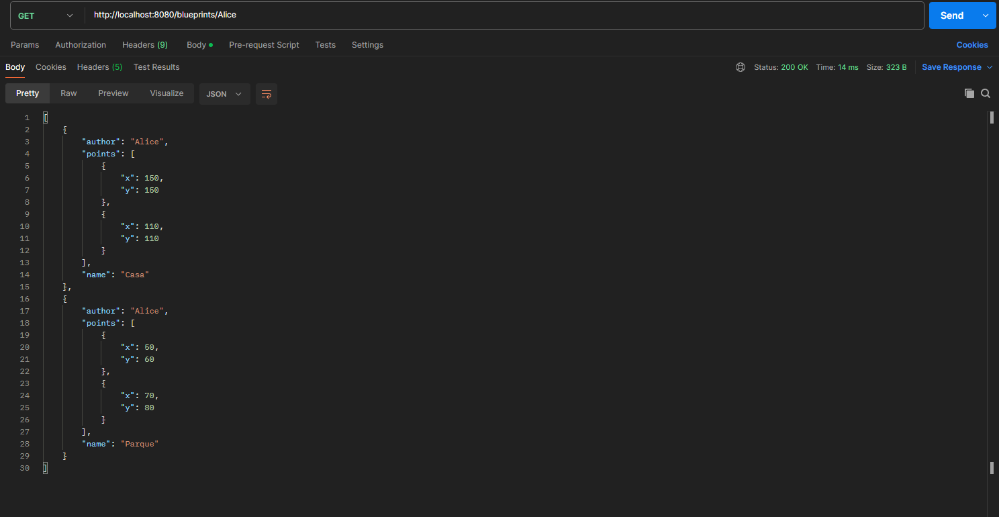

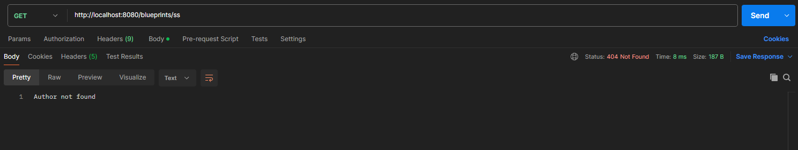

Se implementó un nuevo método GET en el controlador para atender peticiones al recurso `/blueprints/{author}/{bpname}`, el cual permite obtener un único plano específico, identificado por el nombre del autor y el nombre del plano. La ruta utiliza la anotación `@PathVariable` para capturar los parámetros directamente desde la URL y retornar una representación JSON del plano correspondiente.

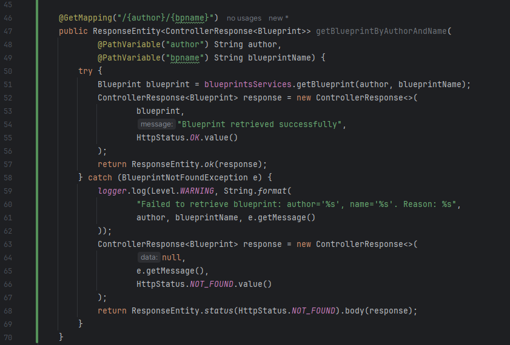

Dado que el controlador no retorna directamente wildcards ni estructuras de respuesta genéricas, se implementó la clase `ControllerResponse`, la cual estandariza la salida del API en una estructura consistente que incluye:

- El contenido (`data`),
- Un mensaje descriptivo (`message`),
- Y el código de estado (`status`).

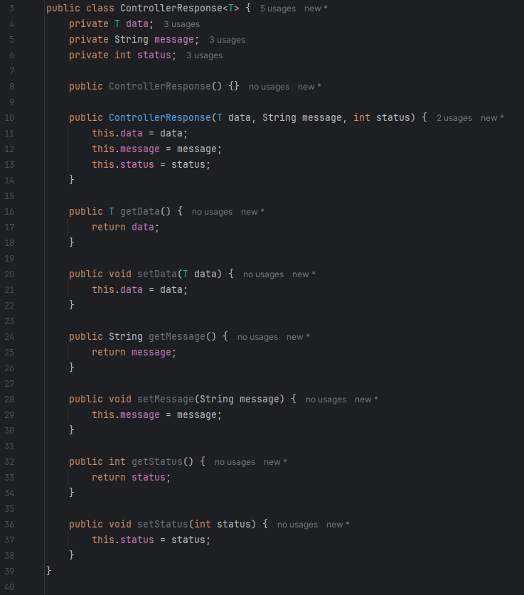

Esta clase mejora la legibilidad y trazabilidad de las respuestas, especialmente al realizar pruebas desde herramientas como Postman. Su constructor tiene la siguiente estructura:

```java
public ControllerResponse(T data, String message, int status) {
    this.data = data;
    this.message = message;
    this.status = status;
}
```

Adicionalmente, se actualizó la clase `InMemoryBlueprintPersistence`, encargada de simular la lógica de persistencia, para validar adecuadamente la existencia del autor y del plano solicitado. Se utilizaron excepciones personalizadas (`BlueprintPersistenceException`) para manejar los casos en los que alguno de los parámetros no se encuentra registrado, garantizando una respuesta con el código de estado HTTP 404 cuando corresponde.

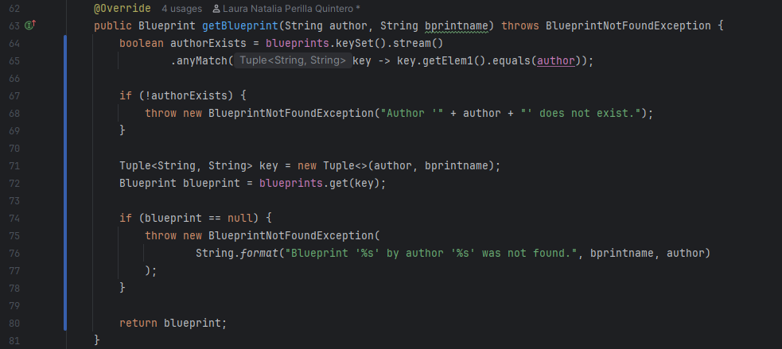

Para validar el funcionamiento, se realizaron tres pruebas de aceptación:

1. **Caso exitoso:** Se obtiene un plano cuando existen tanto el autor como el nombre del plano.

    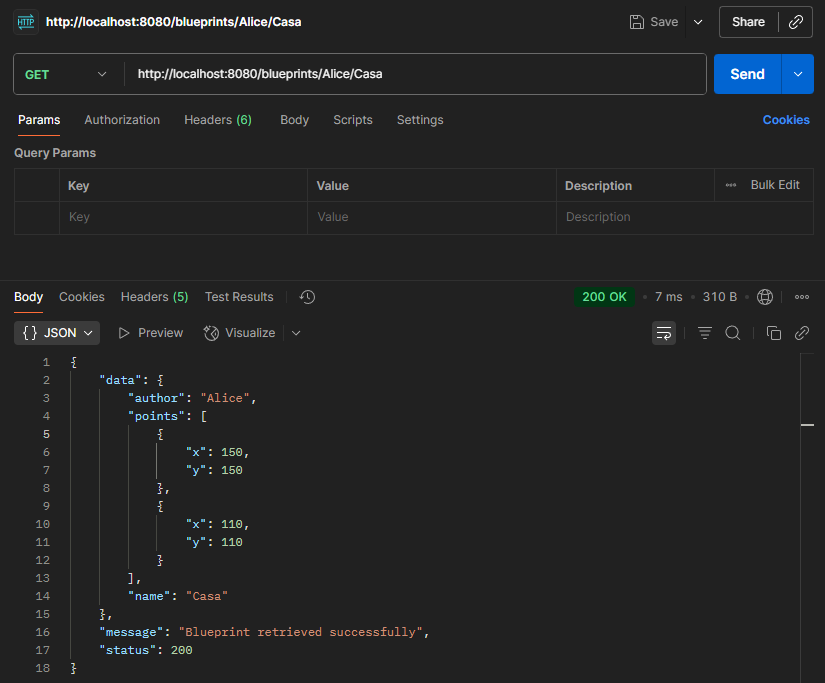

2. **Plano inexistente:** Se retorna HTTP 404 cuando el autor existe, pero el nombre del plano no está registrado.

    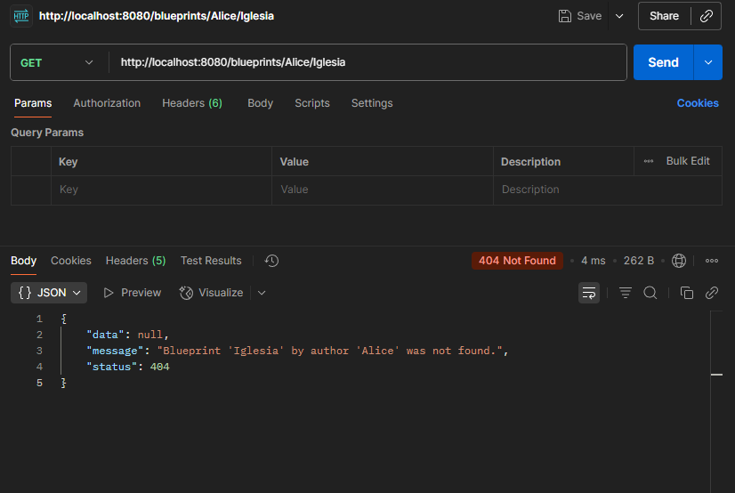

3. **Autor inexistente:** Se retorna HTTP 404 cuando el autor no está registrado en el sistema.

    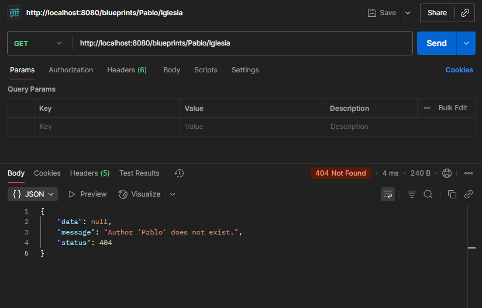

## Parte II. Creación, Consulta y Actualización de Planos vía API REST


Se implementó un nuevo método HTTP POST en el controlador `BlueprintsController`, con el propósito de permitir la creación de nuevos planos mediante el consumo de un recurso REST. Este nuevo endpoint expone el recurso `/blueprints` y permite a los clientes registrar un plano enviando un objeto JSON con los campos requeridos: el nombre del autor, el nombre del plano y la lista de coordenadas que lo componen.

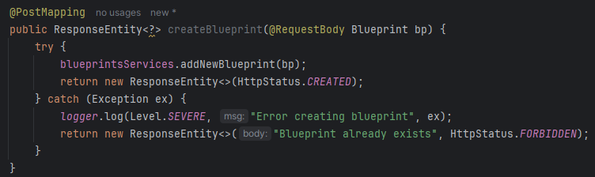

Para verificar que el recurso `/blueprints` acepta e interpreta correctamente las peticiones POST, se utilizó Postman como herramienta de prueba. A través de esta, se enviaron objetos JSON representando nuevos planos, los cuales incluían el nombre del autor, el nombre del plano y la lista de coordenadas que lo definen.

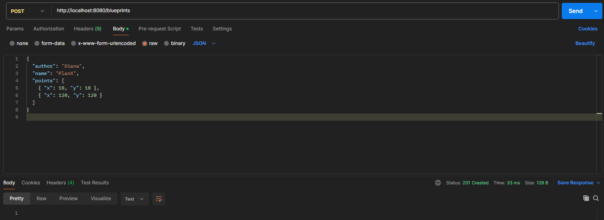

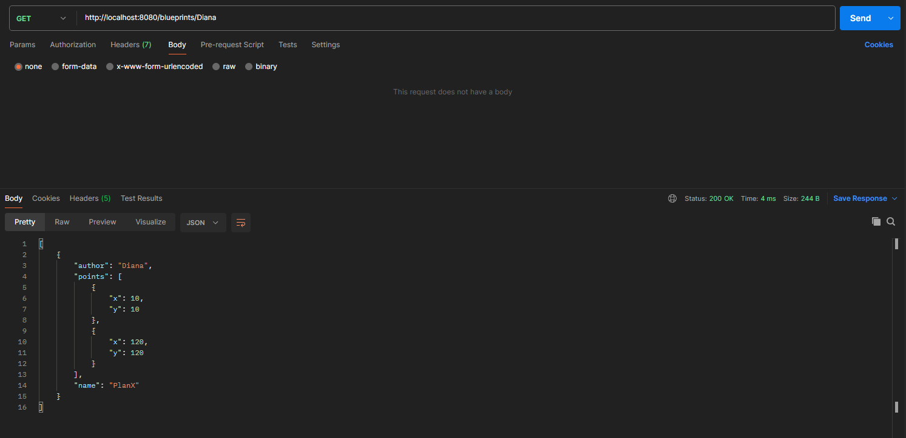

La lógica implementada en el método POST del controlador fue diseñada para manejar adecuadamente los códigos de estado HTTP, retornando un **201 Created** cuando el plano se registra exitosamente, y un **403 Forbidden** en caso de errores controlados, como intentos de insertar un plano ya existente. Esta gestión de respuestas garantiza un comportamiento coherente con las buenas prácticas del protocolo HTTP y facilita la integración con clientes HTTP como Postman.

Posteriormente, se verificó que el plano registrado mediante una petición POST pudiera ser consultado correctamente mediante el recurso GET `/blueprints/{author}/{bpname}`.

Para ello, utilizando nuevamente Postman, se realizó una solicitud GET con los parámetros del autor y el nombre del plano previamente registrados. La respuesta fue exitosa, retornando el objeto JSON correspondiente al plano solicitado, lo cual confirma que el recurso fue almacenado y es accesible a través del endpoint diseñado.

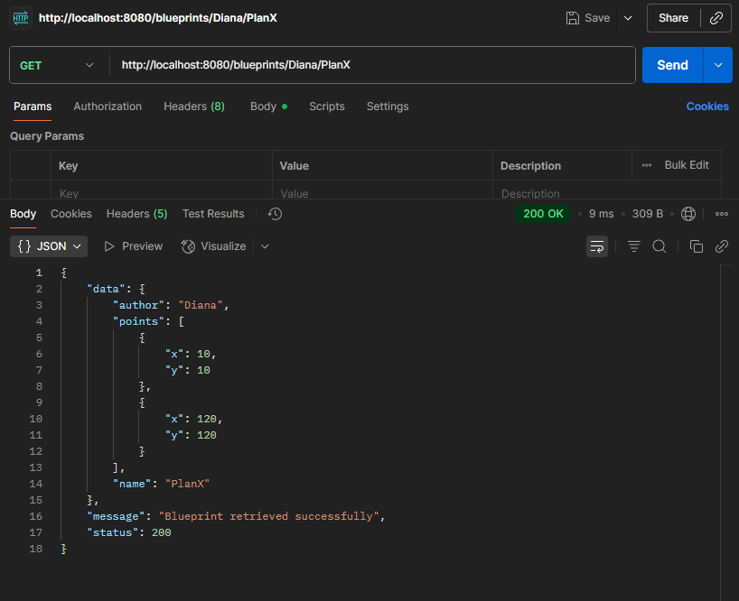

4. Agregue soporte al verbo PUT para los recursos de la forma '/blueprints/{author}/{bpname}', de manera que sea posible actualizar un plano determinado.

Se implementó soporte para el verbo PUT sobre el recurso `/blueprints/{author}/{bpname}`, permitiendo así la actualización de planos existentes a través del controlador `BlueprintsController`.

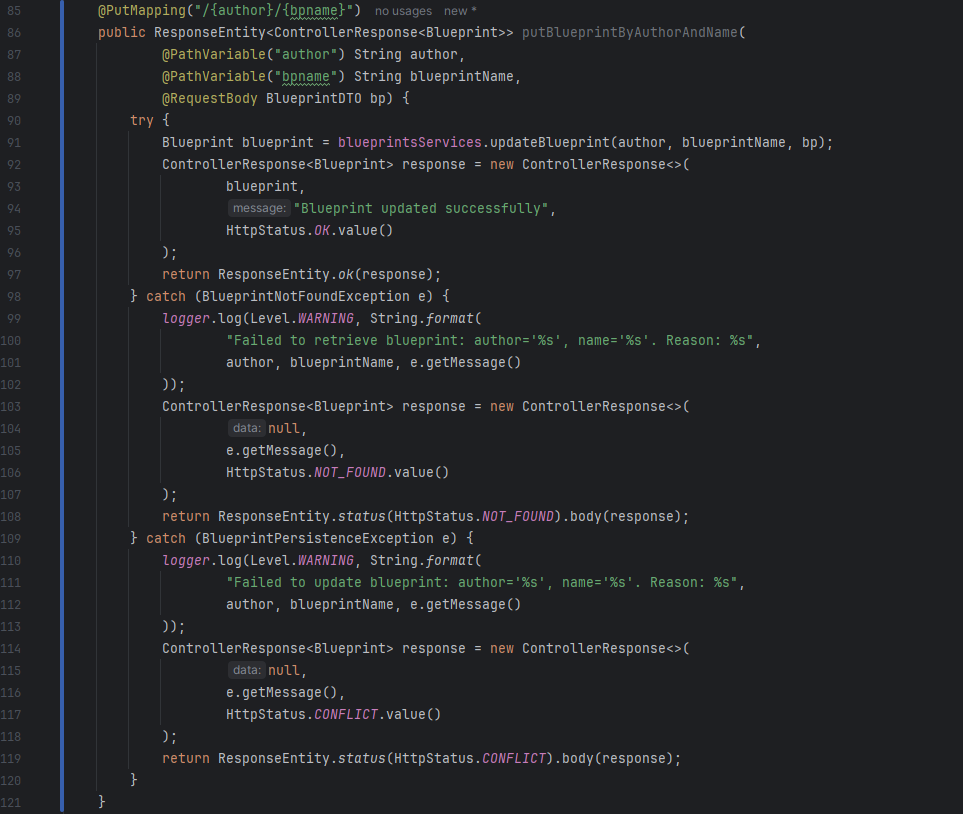

En la capa de servicios, se añadió un nuevo método dentro de `BlueprintService` que encapsula la lógica de negocio necesaria para validar y procesar la actualización del plano.

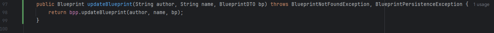

En la capa de persistencia simulada (`InMemoryBlueprintPersistence`), se implementó la verificación para comprobar que:

- El autor del plano existe.
- El plano con el nombre especificado existe para dicho autor.
- La tupla `(author, bpname)` corresponde a un plano válido que puede ser actualizado.


Se realizaron múltiples pruebas utilizando Postman para validar el comportamiento del endpoint `PUT`.

Se actualizó el plano `Parque` del autor `Alice` utilizando el siguiente JSON como cuerpo de la petición:

```JSON
{
    "author": "Carlos",
    "points": [
        {
            "x": 45,
            "y": 60
        },
        {
            "x": 90,
            "y": 30
        },
        {
            "x": 150,
            "y": 75
        }
    ],
    "name": "BosqueSur"
}
```

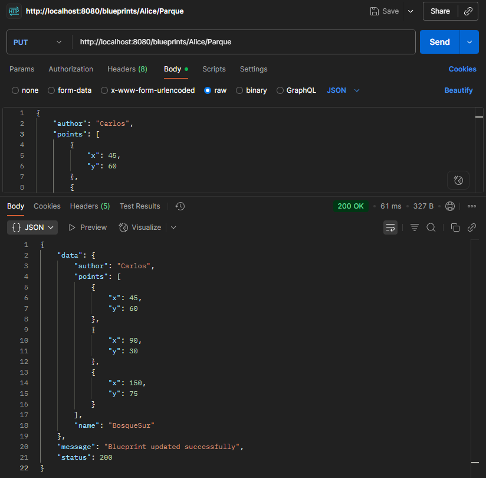

Posteriormente, se verificó mediante una petición GET a `/blueprints/Carlos/BosqueSur` que el plano fue actualizado correctamente:

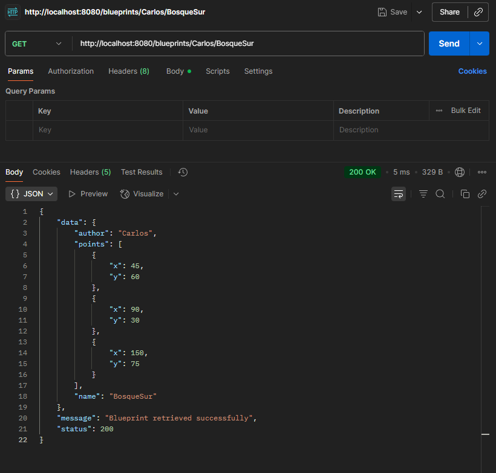

El sistema valida que no se permita la creación de duplicados al actualizar. Si el autor destino ya tiene un plano con el mismo nombre, la solicitud es rechazada.

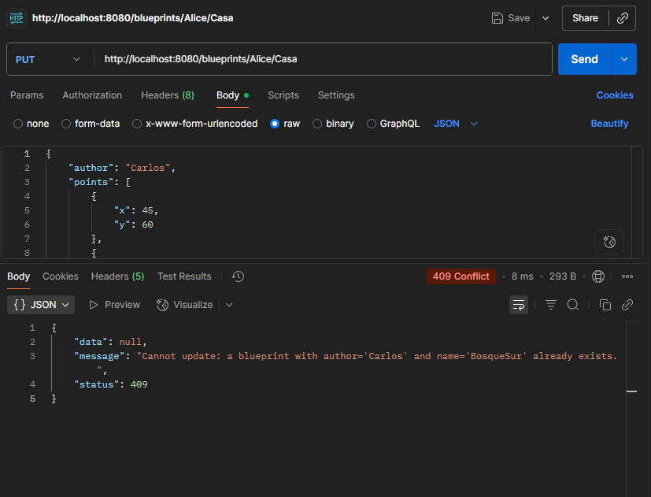

Si el autor original del plano no existe, se retorna un error controlado.

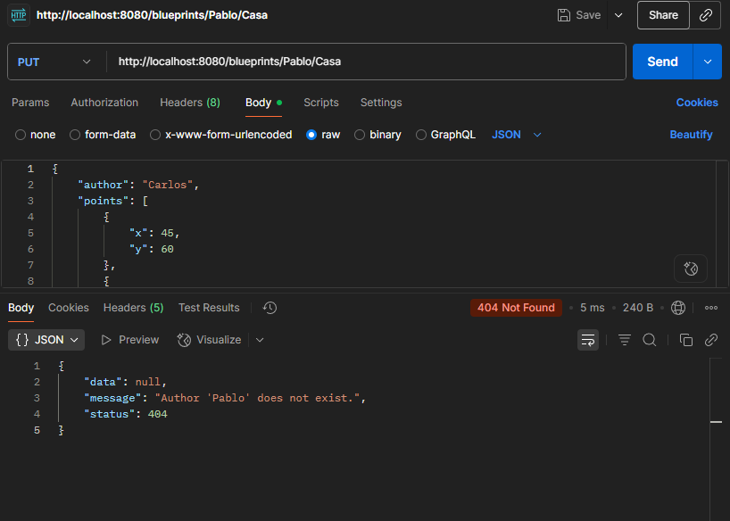

Si no existe el plano con el nombre especificado para el autor dado, no se realiza la actualización.

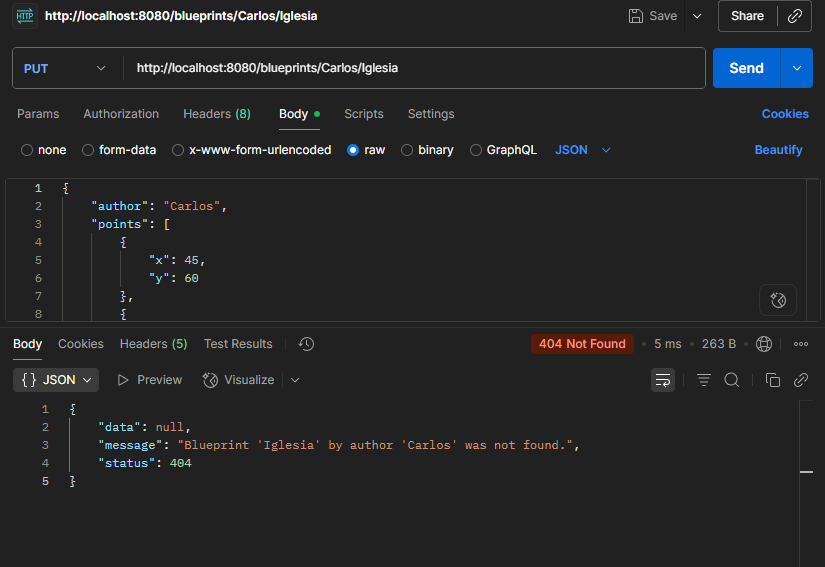

El uso del patrón **DTO (Data Transfer Object)** permite mayor flexibilidad en las actualizaciones. Es posible, por ejemplo, modificar únicamente ciertos atributos como el nombre o el autor, sin necesidad de enviar la lista completa de puntos.

Se realizó una prueba enviando solo el nuevo nombre y autor en el cuerpo de la petición. El sistema aplicó correctamente los cambios, ignorando los campos no enviados:

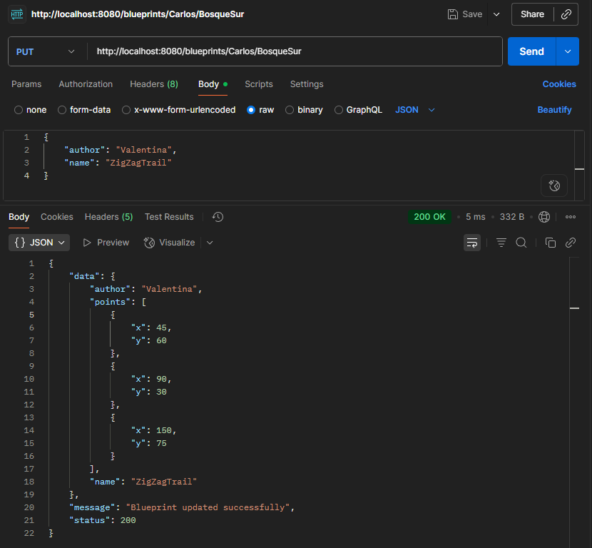

### Parte III

El componente BlueprintsRESTAPI funcionará en un entorno concurrente. Es decir, atederá múltiples peticiones simultáneamente (con el stack de aplicaciones usado, dichas peticiones se atenderán por defecto a través múltiples de hilos). Dado lo anterior, debe hacer una revisión de su API (una vez funcione), e identificar:

* Qué condiciones de carrera se podrían presentar?
* Cuales son las respectivas regiones críticas?

Ajuste el código para suprimir las condiciones de carrera. Tengan en cuenta que simplemente sincronizar el acceso a las operaciones de persistencia/consulta DEGRADARÁ SIGNIFICATIVAMENTE el desempeño de API, por lo cual se deben buscar estrategias alternativas.

Escriba su análisis y la solución aplicada en el archivo ANALISIS_CONCURRENCIA.txt

#### Criterios de evaluación

1. Diseño.
    * Al controlador REST implementado se le inyectan los servicios implementados en el laboratorio anterior.
    * Todos los recursos asociados a '/blueprint' están en un mismo Bean.
    * Los métodos que atienden las peticiones a recursos REST retornan un código HTTP 202 si se procesaron adecuadamente, y el respectivo código de error HTTP si el recurso solicitado NO existe, o si se generó una excepción en el proceso (dicha excepción NO DEBE SER de tipo 'Exception', sino una concreta)
2. Funcionalidad.
    * El API REST ofrece los recursos, y soporta sus respectivos verbos, de acuerdo con lo indicado en el enunciado.
3. Análisis de concurrencia.
    * En el código, y en las respuestas del archivo de texto, se tuvo en cuenta:
        * La colección usada en InMemoryBlueprintPersistence no es Thread-safe (se debió cambiar a una con esta condición).
        * El método que agrega un nuevo plano está sujeta a una condición de carrera, pues la consulta y posterior agregación (condicionada a la anterior) no se realizan de forma atómica. Si como solución usa un bloque sincronizado, se evalúa como R. Si como solución se usaron los métodos de agregación condicional atómicos (por ejemplo putIfAbsent()) de la colección 'Thread-Safe' usada, se evalúa como B.